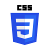
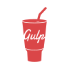

### Hello and Welcome

My name is Sergey Novikov. I'm a frontend-dev and I like it `:3`  

If you want to know more about me, check out my [«Intro»](https://snovikov-intro.ru/).  
Or you can [go straight to the «Intro» sources](https://github.com/ZomboBombo/intro) and see what's going on under the hood.

---

### Stack:

<table>
    <tbody>
        <tr>
            <th scope="row">markup</th>	
            <td>html, pug, nunjucks</td>
        </tr>
        <tr>
            <th scope="row">styles</th>	
            <td>css, sass</td>
        </tr>
        <tr>
            <th scope="row">prog langs</th>	
            <td>js, typescript, dart</td>
        </tr>
        <tr>
            <th scope="row">tools</th>
            <td>gulp, webpack, vite</td>
        </tr>
        <tr>
            <th scope="row">frameworks</th>
            <td>vue, flutter</td>
        </tr>
    </tbody>
</table>

---

### Stack (but beautiful pictures):

